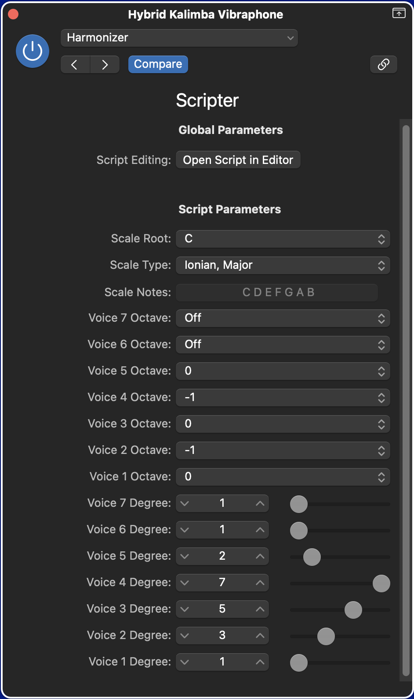

### Logic Pro Scripter scripts

----

### harmonizer.js

Harmonizes pitches using a specified scale and chord voicing.

Logic Pro ships with a script of the same name that decorates an incoming  `NoteOn` event with pitches at fixed transpositions of the incoming pitch.

This script generalizes this idea by allowing the user to choose:
 - an underlying scale from which the harmonizing pitches are drawn,
 - a shape with which to voice the resulting chord.

In the example above, the user specifies that pitches from the C major scale be harmonized with drop 2 & 4 voicings of the diatonic 7th chords of the C major scale, and that pitches outside the parent scale be suppressed.

The stock script that ships with Logic Pro can thus be seen as a special case in which the parent scale is chromatic.

I've provided a set of scales that includes all modes of the:
- symmetric diminished
- major
- melodic minior
- harmonic minor
- double harmonic minor
- whole tone
- pentanonic

scales, as well as one or two others, but if you edit the script it should be obvious how you add more, as well as how to change the number of voices in the chord voicing.
